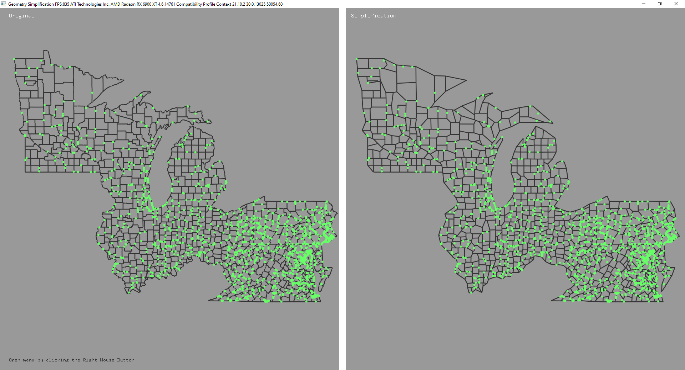
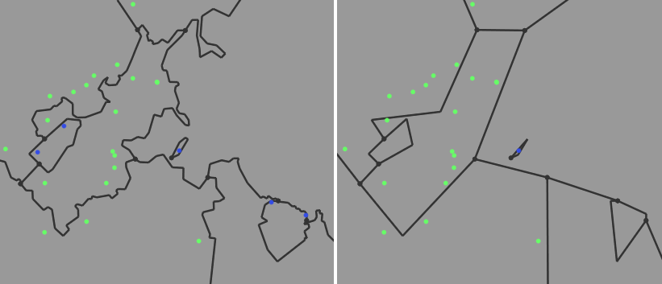

# Map Simplification

## Problem
The challenge posed in 2014 by the ACM SIGSPATIAL comittee is a geometry / map generalization problem. The challenge is to create an algorithm which simplifies the geometry of an input map, represented by a set of lines, while preserving all topological properties of the original geometry. Additionally, control points have been added to the input geometry, these points must remain in the same geometric plane during the simplification process. Furthermore, simplification must be done by only removing vertices from the input meaning we cannot introduce vertices that do not appear in the input.

## Algorithm
We chose to implement the Visvalingam - Whyatt algorithm as a basis for our algorithm and extended it to be able to preserve al the topological constraints in the output. The algorithm uses area preservation as a basis, which extends to shape preservation. This algorithm deletes the vertices of a line which create the least additional area to the shape and results in a simplification where the initial shape is still recognisable. 

## Training results
The algorithm has been tested using the training
datasets provided by the ACM SIGSPATIAL
comittee. These datasets each contain a map
of one or more North American states and their
respective counties.

*Simplification of Massachusetts (U.S.)*

These results have been obtained by running the algorithm on the specified dataset while having the parameter
`PointsToRemove` set to -1. Meaning it will remove the maximum number of possible vertices without affecting the integrity of areas and control points.

| Training Dataset | 1      | 2      | 3      | 4      | 5      |
|------------------|--------|--------|--------|--------|--------|
| Running time     | 0.107s | 0.155s | 0.217s | 1.562s | 0.676s |
| Passes           | 3      | 5      | 3      | 3      | 3      |
| Input verts.     | 992    | 1564   | 8531   | 28014  | 28323  |
| Output verts.    | 65     | 137    | 986    | 2809   | 4955   |
| Removed verts.   | 927    | 1427   | 7545   | 25205  | 23368  |
| Rem ratio        | 93.45% | 91.24% | 88.44% | 89.97% | 82.51% |

Results obtained on:

Operating System: Windows 10 Pro 64-bit 
Processor: Intel(R) Core(TM) i7-2600K CPU @ 3.40GHz 
Memory: 16GB RAM 
